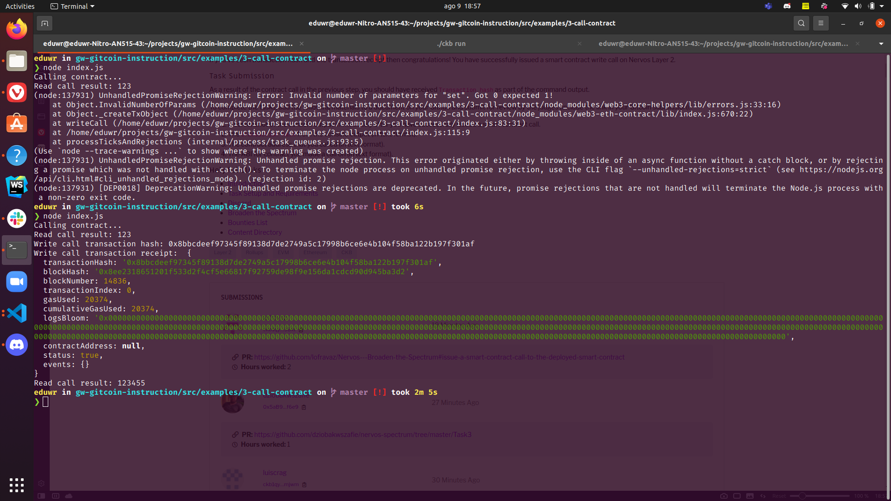

# gitcoin hackaton 3

## A screenshot of the console output immediately after you have successfully issued a smart contract call.

## The transaction hash from the console output (in text format).

[transaction hash](hash.txt)

## The contract address that you called (in text format).

[contract address](contract-addess.txt)

## The ABI for contract you made a call on (in text format).

[contract abi](abi.txt)
